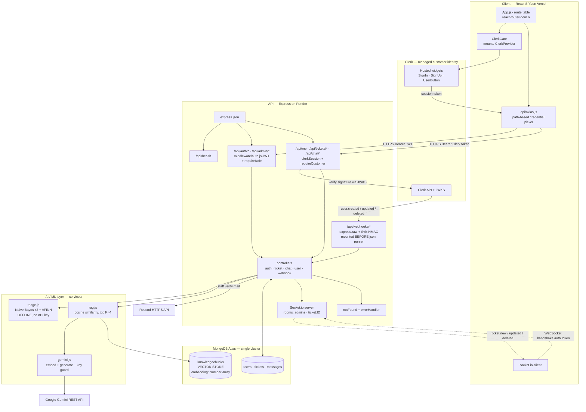
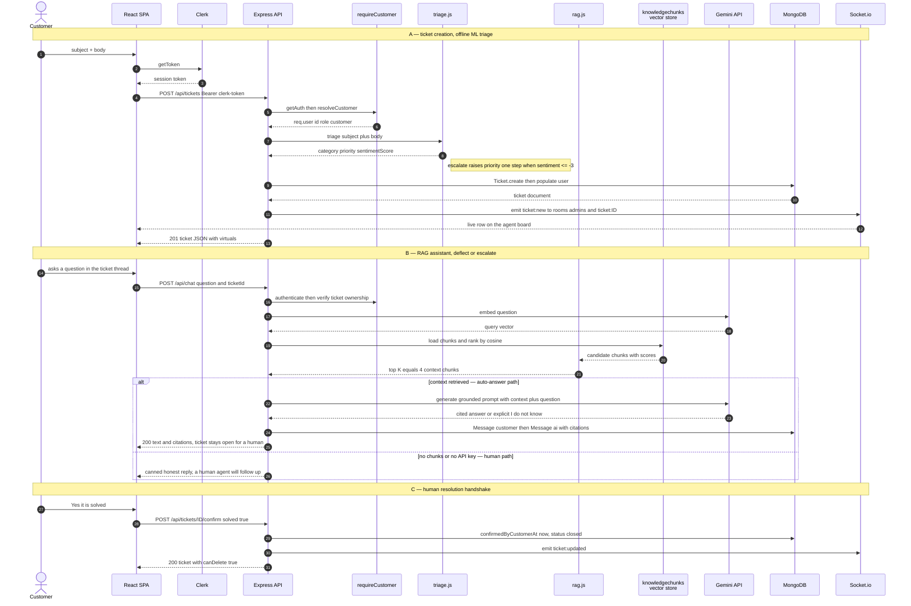
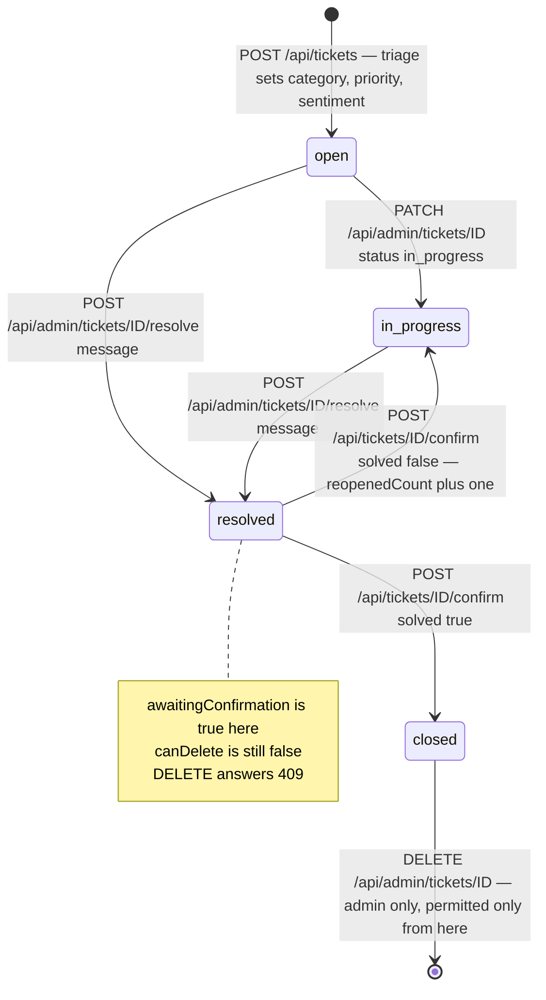
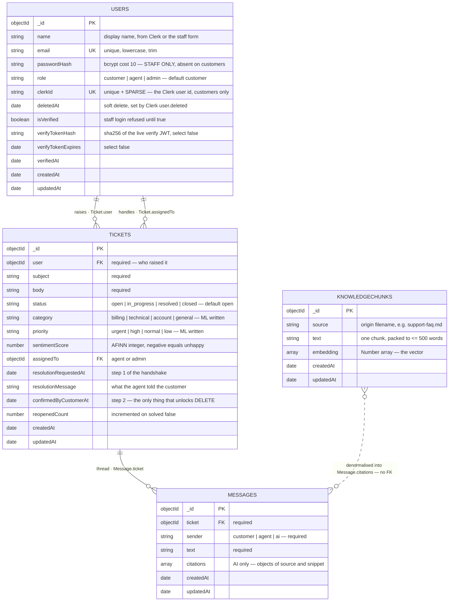
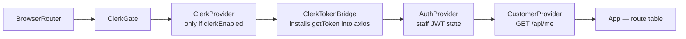
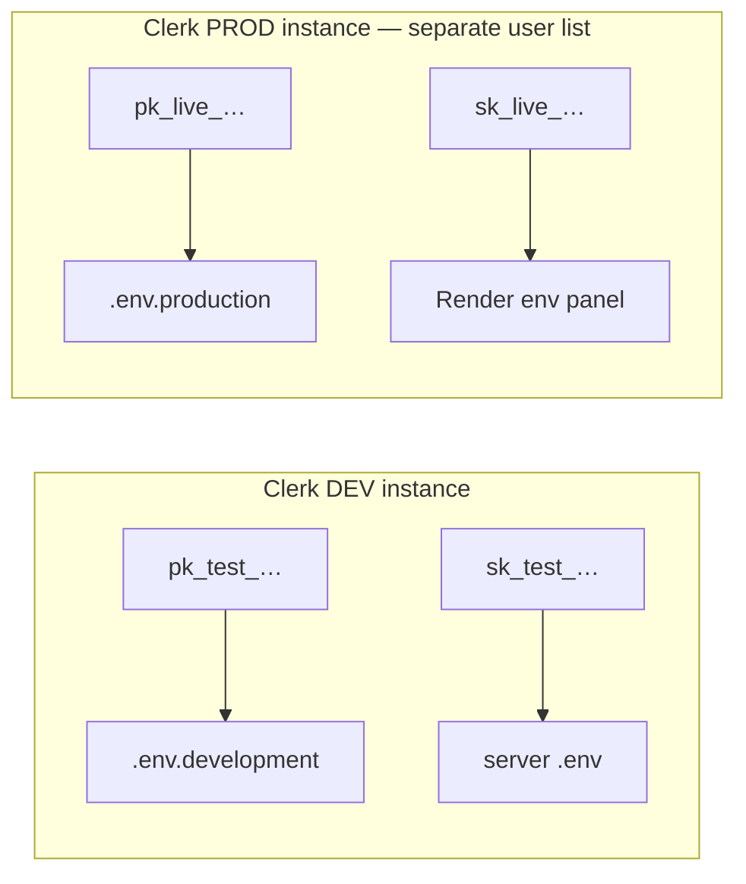
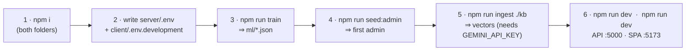

# OptiDesk — Technical Architecture Report

**OptiDesk** is an AI-assisted customer-support ticketing system. Every ticket is auto-triaged **offline** (category, priority, sentiment) by a locally-trained Naive Bayes model; repetitive questions are deflected by a **Gemini RAG assistant** grounded in an embedded knowledge base; everything else is routed to human agents over a **live Socket.io board**. It runs a **dual-authentication architecture**: customers are owned end-to-end by **Clerk**, staff by a self-hosted **JWT + bcrypt + Resend** stack. The two credential systems never meet inside one request.

**Deployment topology — three independently deployed parts:**

| Part | Folder | Runtime | Host | Entry point |
|---|---|---|---|---|
| REST API + WebSocket | `helpdesk-server` | Node ≥18, CommonJS | Render | `server.js` |
| SPA | `helpdesk-client` | React 18 / Vite | Vercel | `src/main.jsx` |
| Database + vector store | — | MongoDB | MongoDB Atlas | `config/db.js` |

**Roles** — one enum on one collection (`User.role`), no separate tables:

| Role | Credential | May reach | Created by |
|---|---|---|---|
| `customer` | Clerk session token | `/api/me`, `/api/tickets/*`, `/api/chat/*` | Clerk sign-up → webhook, or lazy mirror on first request |
| `agent` | custom JWT | all of `/api/admin/*` **except** `DELETE` | `npm run seed:admin` |
| `admin` | custom JWT | all of `/api/admin/*` including `DELETE /tickets/:id` | `seed:admin`, or `POST /api/auth/register` + `ADMIN_SIGNUP_CODE` |

---

## 0. Tech Stack — deep

### 0.1 Server — `helpdesk-server` (`"type": "commonjs"`)

| Package | Ver | Exact role in OptiDesk | Why this, not the obvious alternative |
|---|---|---|---|
| `express` | 4.19.2 | HTTP pipeline; `app.js` mounts 5 routers + 2 terminal handlers | 4.x, not 5.x: the Svix route depends on 4.x `express.raw()` mount-order semantics and the 4-arg error handler |
| `mongoose` | 8.6.0 | ODM for 4 schemas; `populate()` joins, virtuals, `aggregate()` | the raw driver would mean hand-rolling the `populate()` that fills the admin board's *Customer* column |
| `socket.io` | 4.7.5 | live ticket board; `io.use()` handshake gate; rooms `admins` and `ticket:<id>` | raw `ws` has no rooms, no ack, no polling fallback — all three are used |
| `@clerk/express` | ^2.1.66 | customer session verification: `clerkMiddleware()`, `getAuth()`, `verifyToken()` | `requireAuth()` is deprecated and **302-redirects** on failure — fatal for XHR, so the guard is hand-rolled |
| `svix` | ^2.3.0 | HMAC verification of Clerk webhook deliveries | Clerk signs with Svix; verifying by hand means reimplementing timestamp-replay defence |
| `jsonwebtoken` | 9.0.2 | staff session token `{id, role}` (7 d) **and** the email-verification token | stateless → no session store; the verify token is signed with a *derived* secret (§6) |
| `bcryptjs` | 2.4.3 | staff password hashing, cost 10 | pure JS → no `node-gyp` toolchain on Render's build image |
| `natural` | 6.12.0 | two `BayesClassifier`s serialised to `ml/category.json` + `ml/priority.json` | triage must work with **no API key and no network**; an LLM call per ticket is slow and billable |
| `sentiment` | 5.0.2 | AFINN-165 score → priority escalation | returns a comparable integer, so `escalate()` is a two-line rule |
| `@google/generative-ai` | 0.21.0 | `gemini-embedding-001` embeddings + text generation | one SDK covers both halves of RAG |
| `pdf-parse` | 1.1.1 | PDF → text during `npm run ingest` | only needed by the ingest script, never at request time |
| `resend` | **6.26.0** (pinned) | staff verification email over the **HTTPS** API | Render blocks outbound TCP 25/465/587 → nodemailer SMTP dies with `ETIMEDOUT` |
| `cors` | 2.8.5 | origin allow-list, re-exported to Socket.io | one list, two servers — see `app.js:74` |
| `dotenv` | 16.4.5 | loaded on line 2 of `server.js`, before anything reads `process.env` | key-presence checks run at boot, not at first request |
| `multer` | 1.4.5-lts.1 | multipart handling — dependency present, **no upload route mounted yet** | reserved for ticket attachments |
| `nodemon` | 3.1.4 (dev) | `npm run dev` reload | picks up route **and** `.env` changes |

### 0.2 Client — `helpdesk-client` (`"type": "module"`)

| Package | Ver | Exact role | Notes |
|---|---|---|---|
| `react` / `react-dom` | 18.3.1 | SPA; state in two Contexts (`AuthContext` staff, `CustomerContext` customer) | StrictMode double-mount is load-bearing in `ClerkGate` (§5.3) |
| `react-router-dom` | 6.26.2 | route table in `App.jsx` | splat routes `/login/*`, `/signup/*` are **required** — Clerk's `routing="path"` navigates to `/login/factor-one`, `/login/sso-callback`, … |
| `@clerk/clerk-react` | ^5.61.9 | `ClerkProvider`, `SignIn`, `SignUp`, `UserButton`, `useAuth`, `useUser` | ESM-only dist; `routerPush`/`routerReplace` must be supplied as a pair |
| `axios` | 1.7.7 | one instance; request interceptor picks the credential **from the URL path** | `src/api/axios.js` — the single most important 20 lines on the client |
| `socket.io-client` | 4.7.5 | live board subscription | currently used only by `AdminDashboard.jsx` |
| `vite` | 5.4.8 | dev server on :5173, production bundler | `VITE_*` vars are **inlined into the public bundle** — never secrets |
| `@vitejs/plugin-react` | 4.3.1 | JSX + HMR | |
| `tailwindcss` + `@tailwindcss/vite` | 4.3.3 | styling | Tailwind **v4**: no `tailwind.config.js`, no `postcss.config.js`; the theme lives in the `@theme` block at the top of `src/index.css` (918 lines) |

### 0.3 External managed services

| Service | Responsibility | Server-side secret | Client-side public value |
|---|---|---|---|
| **Clerk** | customer identity: sign-up, sign-in, MFA, email verification, session lifetime | `CLERK_SECRET_KEY`, `CLERK_WEBHOOK_SECRET` | `VITE_CLERK_PUBLISHABLE_KEY` (`pk_test_…` / `pk_live_…`) |
| **MongoDB Atlas** | documents **and** embedding vectors, one cluster | `MONGO_URI` | — |
| **Google Gemini** (AI Studio) | embeddings + grounded generation | `GEMINI_API_KEY` | — |
| **Resend** | staff verification mail over HTTPS | `RESEND_API_KEY`, `MAIL_FROM` | — |
| **Render** | API + WebSocket host | — | — |
| **Vercel** | static SPA host | — | `vercel.json` rewrites every path to `index.html` |

---

## 1. High-Level System Architecture



### 1.1 The load-bearing rule: URL prefix ⇒ credential

There is **no per-request flag** deciding which token to attach. The URL space is deliberately partitioned so both the browser and the server can decide from the path alone. Moving a staff endpoint out from under `/api/admin` would silently start sending it a customer's Clerk token.

| URL prefix | Caller | Credential | Verified by | Populates |
|---|---|---|---|---|
| `/api/webhooks/*` | Clerk's servers | Svix HMAC over the **raw body** | `svix.Webhook.verify()` | — |
| `/api/health` | anyone / uptime probe | none | — | — |
| `/api/auth/*` | staff browser | e-mail + password → JWT | `bcrypt.compare` then `jwt.sign` | `req.user` on `/me` only |
| `/api/admin/*` | staff browser | `Bearer <custom JWT>` | `middleware/auth.js` + `requireRole('agent','admin')` | `req.user = {id, role}` from the token payload |
| `/api/me`, `/api/tickets/*`, `/api/chat/*` | customer browser | `Bearer <Clerk session token>` | `clerkSession` → `getAuth(req)` → `resolveCustomer()` | `req.user = {id, role:'customer', clerkId, email}`, `req.customer` = full doc |

Client mirror — `src/api/axios.js`: `const STAFF_PATH = /^\/(admin|auth)(\/|$)/`. Match ⇒ `localStorage.token`; otherwise ⇒ `await clerkTokenGetter()`. A `401` clears `localStorage` **only** on a staff path, so a failed customer request can never sign an admin out of their own board.

### 1.2 Middleware pipeline, in mount order (`app.js`)

1. `cors({ origin })` — allow-list built from `CLIENT_URL` + `CORS_ORIGINS`; empty list ⇒ allow all (local only); a missing `Origin` header (curl, server-to-server) is never blocked.
2. **`app.use('/api/webhooks', webhookRoutes)`** — before any body parser. The router applies `express.raw({ type: 'application/json' })` to its own path only. Once `express.json()` consumes the stream the original bytes are unrecoverable and the HMAC can never match again.
3. `express.json()`
4. `GET /api/health` → `{ ok, service, customerAuth: 'clerk' | 'off' }` — the fastest way to prove which auth mode the deployed API booted in.
5. `/api/auth` → `authRoutes` (staff password + Resend verification)
6. `/api/admin` → `adminRoutes`, which begins `router.use(auth, requireRole('agent','admin'))`
7. `GET /api/me` → `clerkSession, requireCustomer, myProfile`
8. `/api/tickets` → `clerkSession` + `ticketRoutes` (which begins `router.use(requireCustomer)`)
9. `/api/chat` → `clerkSession` + `chatRoutes` (same)
10. `notFound` → `404 { error: "Not found: <METHOD> <url>" }`
11. `errorHandler` → `CastError` ⇒ 400 `Invalid id`; `ValidationError` ⇒ 400 with the Mongoose message; otherwise `err.status || 500`

`clerkSession` is created **lazily** and degrades to a passthrough when `CLERK_SECRET_KEY`/`CLERK_PUBLISHABLE_KEY` are absent — an unkeyed `clerkMiddleware()` calls `next(err)` and would turn every request it touches into a 500, taking the staff half of the app down with it.

### 1.3 Customer identity: Clerk ⇄ MongoDB mirroring

`Ticket.user` is a Mongoose `ObjectId` ref and the admin board's *Customer* column is a `populate()` of it, so a Clerk id string (`user_2ab…`) stored there would fail schema validation and destroy every join. Each Clerk account therefore gets exactly **one** local `User` document, linked by `clerkId`.

The mirror is created by **two independent paths**, so neither is a single point of failure:

| Path | When | Code |
|---|---|---|
| **Webhook** (preferred) | Clerk POSTs `user.created` / `user.updated` / `user.deleted` | `controllers/webhookController.js` |
| **Lazy resolver** (fallback) | first authenticated request from an unseen `clerkId` | `resolveCustomer()` in `middleware/clerkAuth.js` |

Without the fallback, signing up would appear to work and then every ticket call would fail with "customer not found" whenever the webhook is unconfigured — which is the normal state in local development. Two concurrent first-requests can both miss and both insert; the loser gets Mongo `E11000` and simply re-reads the row that now exists.

**Two hard rules inside the mirror (`upsertCustomerFromClerk`):**
- `role` is **hard-coded** to `'customer'` and is never read from a token claim, so no Clerk JWT claim can widen permissions.
- A Clerk email matching an existing **non-customer** row is refused with `409 staff_email_conflict` — otherwise anyone able to receive mail at the admin address could sign up through Clerk and inherit that row's admin role.
- `user.deleted` is a **soft** delete (`deletedAt = new Date()`), because tickets and messages still reference the row; a hard delete would leave the admin board with unresolvable owners.

---

## 2. Core Backend Logic & AI Data Flow

OptiDesk runs **two independent AI subsystems**. They share no code path and fail independently:

| | **Pipeline A — Triage** | **Pipeline B — RAG assistant** |
|---|---|---|
| Trigger | `POST /api/tickets` (ticket creation) | `POST /api/chat` (customer question) |
| Engine | `natural` Naive Bayes ×2 + `sentiment` AFINN | Gemini embeddings + Gemini generation |
| Network | **none** — 100 % offline | Google Gemini REST, per request |
| Needs a key | no | yes (`GEMINI_API_KEY`) |
| Latency | sub-millisecond, synchronous | one embedding call + one generation call |
| Failure mode | falls back to `general` / `normal` | `503 GEMINI_NOT_CONFIGURED`, or an honest "a human agent will follow up" |
| Writes | `Ticket.category`, `.priority`, `.sentimentScore` | two `Message` docs (`customer`, `ai`) + citations |

### 2.1 Pipeline A — AI Triage & Ticket Creation, step by step

1. **Browser** — `Tickets.jsx` submits `{ subject, body }`; axios matches no staff prefix, so it `await`s Clerk's `getToken()` and attaches `Authorization: Bearer <clerk session token>`. `getToken()` is awaited **per request**, not cached at sign-in, because it silently refreshes a session about to expire.
2. **`clerkSession`** — `clerkMiddleware()` parses the token and populates `req.auth`.
3. **`requireCustomer`** — `getAuth(req).userId` → `resolveCustomer()` → local `User` doc → `req.user = { id, role:'customer', clerkId, email }`. Controllers never learn which auth system the caller used.
4. **`createTicket`** — rejects a missing `subject`/`body` with `400`.
5. **`triage(`subject + ' ' + body`)`** (`services/triage.js`):
   - `categoryClf.classify(text)` → `billing | technical | account | general`
   - `priorityClf.classify(text)` → `urgent | high | normal | low`
   - `sentiment.analyze(text).score` → signed integer (negative = unhappy)
   - **`escalate()`** — when `sentimentScore <= -3`, priority moves **one step more urgent** (`PRIORITIES[max(0, i-1)]`), so an angry *"this is broken and I'm furious"* never sits at `normal`.
   - Both classifiers are loaded **once, asynchronously, at module load** from `ml/category.json` and `ml/priority.json`. If those files are missing (`npm run train` never ran) or a label falls outside the enum, `safeClassify()` returns the safe default instead of throwing — a ticket is **never lost** to a missing model.
6. **`Ticket.create({ user: req.user.id, subject, body, category, priority, sentimentScore })`**
7. **`await ticket.populate('user', 'name email role')`** — done *before* broadcasting, otherwise the row that appears live on the admin board would have a blank *Customer* column.
8. **`emit('ticket:new')`** to room `admins` **and** room `ticket:<id>`.
9. **`201`** with the full ticket JSON, including the `canDelete` / `awaitingConfirmation` virtuals.

**Training the classifiers** — `npm run train` (`ml/train.js`) fits both models on **92 hand-labelled support tickets** (billing 24, technical 24, account 22, general 22), each carrying both a category and a priority label, then serialises them with `BayesClassifier.save()`. `ml/*.json` is **git-ignored**: it is a build artefact, so `npm run train` is a required step on any fresh clone or deploy.

### 2.2 Pipeline B — RAG assistant, step by step

1. **Ingest, offline** — `npm run ingest` (`scripts/ingestKnowledge.js`) reads `helpdesk-server/knowledge/*.{md,txt,pdf}` (currently `support-faq.md`), splits on blank lines first so FAQ sections stay whole, then packs paragraphs into **≤500-word chunks**, embeds each with `gemini-embedding-001`, and stores `{ source, text, embedding }`. The collection is **wiped first** (`deleteMany({})`) so re-running never duplicates.
2. **Question arrives** — `POST /api/chat { question, ticketId? }`. If `ticketId` is present, ownership is enforced *before* any AI work: staff pass, otherwise `String(ticket.user) !== req.user.id` ⇒ `403`.
3. **Embed the query** — `embed(question)` → query vector (input truncated to 8 000 chars).
4. **Retrieve** — `KnowledgeChunk.find().lean()` loads every chunk and ranks by **in-memory cosine similarity**; the top **K = 4** become context. This is the deliberate trade-off documented in `rag.js`: exact and dependency-free for a few hundred chunks, and swappable for an Atlas Vector Search index behind the `USE_ATLAS_VECTOR` flag when the KB outgrows it.
5. **Build the grounded prompt** — chunks are numbered `[1] (source: …)`; the system instruction constrains the model to answer **only** from the context, to admit ignorance rather than invent, and to cite inline.
6. **Generate** — `generate(prompt)` on `GEMINI_CHAT_MODEL` (default `gemini-3.6-flash`).
7. **Persist** — two `Message` docs (`sender:'customer'`, then `sender:'ai'` with `citations`). Wrapped in its own `try/catch`: a save hiccup logs a warning and **never** fails the reply the customer is waiting for.
8. **Respond** — `{ text, citations: [{ source, snippet }] }`; `TicketChat.jsx` renders `[1] source-name` chips under the bubble.

### 2.3 Sequence — message in, RAG context, LLM, decision, DB write, response out



**Deviation from the generic "LLM decides auto-resolve vs create ticket" pattern — stated plainly:** in OptiDesk the ticket is created **first**, by the customer, and the escalate/deflect decision is *not* an LLM tool call. It is (a) a **retrieval-confidence branch** in `rag.js` — zero chunks ⇒ refuse to answer and hand off to a human — plus (b) the model's own instruction to say *"I don't have that information"* rather than invent one, plus (c) the human confirmation gate in §2.4. Nothing the LLM outputs can close a ticket. That is a security property, not an omission: an LLM that could set `status` would be a prompt-injection path straight into the ticket lifecycle.

### 2.4 Ticket lifecycle — a 3-step resolution handshake, enforced server-side

Neither an agent nor an admin can close or delete a ticket on the customer's behalf. `status` is not freely writable: `updateTicket` accepts only `MANUAL_STATUSES = ['open','in_progress']` and answers `400` for anything else, naming the correct endpoint.



| Step | Endpoint | Who | Side effects |
|---|---|---|---|
| 1 — propose | `POST /api/admin/tickets/:id/resolve { message }` | agent / admin | `status='resolved'`, `resolutionRequestedAt=now`, `resolutionMessage`, auto-assigns `assignedTo` to the responder if unset, writes a `Message{sender:'agent'}`, emits `ticket:updated`. Refuses `409` if already confirmed. Does **not** close the ticket and does **not** unlock deletion. |
| 2 — confirm | `POST /api/tickets/:id/confirm { solved, note? }` | **only the customer who raised it** — staff are rejected `403` | `solved:true` ⇒ `confirmedByCustomerAt=now`, `status='closed'`; `solved:false` ⇒ clears the proposal, `status='in_progress'`, `reopenedCount++`. Either way a `Message{sender:'customer'}` is written. `409` if no proposal exists yet. |
| 3 — delete | `DELETE /api/admin/tickets/:id` | **admin only** | Refuses `409` until `confirmedByCustomerAt` is set, with a different message depending on whether a proposal is outstanding. On success: `Message.deleteMany({ticket})` first (no orphaned chat rows), then `ticket.deleteOne()`, then emits `ticket:deleted` to `admins`. |

### 2.5 Degradation matrix — what breaks when a key is missing

The app is designed to boot and stay useful with **any subset** of its integrations configured. `server.js` prints the state of each at startup so a misconfiguration never has to be diagnosed from a browser error.

| Missing | Symptom | Still works |
|---|---|---|
| `VITE_CLERK_PUBLISHABLE_KEY` | `clerkEnabled === false` ⇒ `ClerkProvider` is **not mounted**; `/login` and `/signup` render a self-explaining card | the whole staff app, `/admin/login` included |
| `CLERK_SECRET_KEY` / `CLERK_PUBLISHABLE_KEY` (server) | `503 clerk_not_configured` on `/api/me`, `/api/tickets/*`, `/api/chat/*`; boot log `🔐 Customer sign-in (Clerk): OFF` | `/api/health`, `/api/auth/*`, `/api/admin/*` |
| `CLERK_WEBHOOK_SECRET` | `503 webhook_not_configured` on the webhook; profile edits and deletions in Clerk stop propagating | sign-up — the mirror row is created lazily on first request |
| `GEMINI_API_KEY` | `503 GEMINI_NOT_CONFIGURED` from `/api/chat`; the UI shows a specific "AI assistant is not configured" bubble | ticket creation, triage, the whole staff board — triage is offline |
| `ml/*.json` (never trained) | every ticket lands as `general` / `normal`, one warning per classifier at boot | everything else |
| `knowledgechunks` empty | the assistant says it has nothing to answer from and defers to a human — it does **not** hallucinate | everything else |
| `RESEND_API_KEY` / unverified `MAIL_FROM` | staff verification mail not sent; the link is **printed to the API console** instead; `register` replies `emailSent:false, mailConfigured:<bool>` | account creation, and `POST /api/auth/resend` later |
| `MONGO_URI` | `process.exit(1)` at boot — this one is genuinely fatal | — |

---

## 3. Database Schema

Four collections in one MongoDB database. Mongoose pluralises and lowercases the model name, so `User` → `users`, `Ticket` → `tickets`, `Message` → `messages`, `KnowledgeChunk` → `knowledgechunks`.



### 3.1 Indexes and schema-level constraints

| Collection | Index / constraint | Why it is shaped that way |
|---|---|---|
| `users` | `email` — **unique** | one account per address across all three roles; queries are pre-normalised with `normEmail()` because Mongoose does **not** apply `lowercase`/`trim` setters to query *filters*, so `findOne({email:'Me@x.com'})` would miss the stored `me@x.com` |
| `users` | `clerkId` — **unique + sparse** | `sparse` is what lets one index serve both kinds of account: staff rows have no `clerkId` at all, and a plain unique index would treat every one of their `null` values as a duplicate of the first |
| `users` | `verifyTokenHash`, `verifyTokenExpires` — `select: false` | never returned by an ordinary query; `authController` must opt in with `.select('+verifyTokenHash')` |
| `tickets` | `user`, `assignedTo` — refs to `User` | `populate('user','name email role')` is what turns an id into the board's *Customer* column |
| `tickets` | `status`, `category`, `priority` — enums | an invalid value raises `ValidationError` ⇒ 400, not a silently corrupt row |
| `messages` | `ticket` — ref, required | deleted en masse before the parent ticket, so no orphan rows survive |
| `knowledgechunks` | none — full collection scan by design | cosine ranking happens in Node; `USE_ATLAS_VECTOR` is the documented switch to an Atlas Vector Search index |

### 3.2 Ticket virtuals — one source of truth for UI and API

Declared with `toJSON: { virtuals: true }`, so they are serialised into every response and the client never re-derives the rule:

| Virtual | Definition | Consumed by |
|---|---|---|
| `canDelete` | `Boolean(confirmedByCustomerAt)` | admin UI enables/disables Delete; `deleteTicket` enforces the identical condition server-side |
| `awaitingConfirmation` | `Boolean(resolutionRequestedAt) && !confirmedByCustomerAt` | the customer's "Is your problem solved?" panel and the *Action needed* banner |

### 3.3 Referential integrity notes

- **`knowledgechunks` is standalone.** AI citations are **denormalised copies** (`{source, snippet}`) written onto the `Message` document, so a chat thread stays readable and auditable even after the knowledge base is re-ingested and every chunk `_id` changes.
- **Cascade on delete is manual and ordered:** `Message.deleteMany({ ticket })` runs *before* `ticket.deleteOne()`. Mongoose fires no cascade of its own.
- **Users are never hard-deleted.** `deletedAt` is a soft flag; `listCustomers` filters `{ role:'customer', deletedAt: { $exists: false } }`, and `resolveCustomer` treats a soft-deleted row as absent, then clears `deletedAt` if that Clerk account returns.
- **Aggregation, not N+1:** `GET /api/admin/customers` joins one `Ticket.aggregate()` grouped by `$user` — producing `total`, `open` and `lastTicketAt` per customer — onto the user list, instead of a per-customer count query.
- **Embedding dimension is model-defined**, not schema-constrained: `embedding` is an unconstrained `[Number]`. Two in-code comments disagree about the length (`KnowledgeChunk.js` says 3072 for `gemini-embedding-001`, `gemini.js` says 768) — harmless today because cosine is computed in JS, but the true length must be pinned as `numDimensions` before an Atlas Vector index can be built, and **every chunk must be re-ingested with one model**: vectors from different embedding models are not comparable.

---

## 4. API & Routing Contract

Base URL `<API_URL>/api`. **25 routes**, in real mount order (`node scripts/dumpRoutes.js` prints exactly this list). "Auth level" is the credential the route *requires*; ownership checks marked *owner* are enforced inside the controller, not by the router.

| Endpoint | Method | Auth Level (Role) | Action / Purpose |
|---|---|---|---|
| `/webhooks/clerk` | POST | **Svix HMAC** (Clerk's servers) | `user.created`/`user.updated` ⇒ upsert the local mirror; `user.deleted` ⇒ soft delete. Raw body, mounted before `express.json()`. `503` if unconfigured, `400 bad_signature` if forged |
| `/health` | GET | public | liveness + which auth mode booted: `{ ok, service, customerAuth: 'clerk' \| 'off' }` |
| `/auth/register` | POST | public + `ADMIN_SIGNUP_CODE` | create a **staff** account (role `admin` only). A `role:'customer'` body is refused `400 use_customer_signup` with the correct URL. Issues + emails the verification link, returns `emailSent` / `mailConfigured` |
| `/auth/login` | POST | public | bcrypt compare ⇒ 7-day JWT `{id, role}`. Unverified ⇒ `403 needsVerification`. Every `401` carries the same constant `hint` (never conditional — see §6) |
| `/auth/verify-email` | GET | public (signed token) | consume the verify JWT ⇒ `isVerified=true`. `200 success \| already`, `400 invalid`, `410 expired` |
| `/auth/verify` | GET | public (signed token) | legacy link shape — 302s to the client page carrying the token |
| `/auth/resend` | POST | public | re-issue the link. **One identical reply for every outcome** (unknown / verified / sent / provider down) so it cannot be used as an account oracle |
| `/auth/me` | GET | staff JWT | current staff profile, `passwordHash` stripped |
| `/admin/tickets` | GET | **agent \| admin** | the whole board. Filters: `status`, `priority`, `category`, `customer`, `q` (regex-escaped, matches `subject` or `body`); newest first; `user` + `assignedTo` populated |
| `/admin/tickets/:id` | GET | agent \| admin | one ticket, both people populated |
| `/admin/tickets/:id` | PATCH | agent \| admin | set `assignedTo`, `priority`, and `status` — **restricted to `open`/`in_progress`**; anything else ⇒ `400` naming `/resolve`. Emits `ticket:updated` |
| `/admin/tickets/:id/resolve` | POST | agent \| admin | **step 1**: propose a fix, `status='resolved'`, write an agent `Message`, auto-assign the responder. `409` if already confirmed |
| `/admin/tickets/:id` | DELETE | **admin only** | **step 3**: hard delete + cascade `messages`. `409` until `confirmedByCustomerAt` is set |
| `/admin/customers` | GET | agent \| admin | customer directory + per-customer `total` / `open` / `lastTicketAt` from one aggregation; soft-deleted rows excluded |
| `/admin/agents` | GET | agent \| admin | staff list for the assignee dropdown (`role in ['agent','admin']`) |
| `/admin/customers/:id` | GET | agent \| admin | one customer profile + their full ticket history `{ user, tickets }` |
| `/admin/chat` | POST | agent \| admin | the **same RAG controller** as the customer route, under the staff credential |
| `/admin/chat/:ticketId/history` | GET | agent \| admin | full message thread for any ticket |
| `/me` | GET | **Clerk session** | the customer's local mirror: `{ _id, id, clerkId, name, email, role, isVerified, createdAt }`. Required because ownership is a Mongo `_id` that the Clerk token does not carry |
| `/tickets` | POST | Clerk session (customer) | **create ticket ⇒ offline triage ⇒ broadcast `ticket:new`** (Pipeline A) |
| `/tickets` | GET | Clerk session (customer) | list, hard-scoped to `{ user: req.user.id }` in the controller |
| `/tickets/:id` | GET | Clerk session, **owner** | one ticket; `403` if `ticket.user._id !== req.user.id` |
| `/tickets/:id/confirm` | POST | Clerk session, **owner only** | **step 2**: `{solved:true}` ⇒ `closed` + unlocks DELETE; `{solved:false}` ⇒ `in_progress`, `reopenedCount++`. Staff get `403` — an admin must not confirm on the customer's behalf |
| `/chat` | POST | Clerk session (customer) | **RAG answer** — embed ⇒ cosine top-4 ⇒ Gemini ⇒ `{text, citations}`; persists both messages when `ticketId` is given (Pipeline B) |
| `/chat/:ticketId/history` | GET | Clerk session, **owner** | prior thread, ascending by `createdAt`, so a page refresh loses nothing |

### 4.1 Error contract

Every failure is JSON with an `error` string; machine-readable failures add a stable `code`.

| Status | `code` | Raised by | Meaning |
|---|---|---|---|
| 400 | — | `errorHandler` on `CastError` | malformed `ObjectId` in the URL ⇒ `Invalid id` |
| 400 | — | `errorHandler` on `ValidationError` | enum / required-field violation, Mongoose message passed through |
| 400 | `use_customer_signup` | `authController.resolveRole` | a customer POSTed to the staff register endpoint |
| 400 | `bad_signature` | `webhookController` | wrong `CLERK_WEBHOOK_SECRET`, replayed timestamp, or a forged call |
| 401 | `signed_out` | `requireCustomer` | no `userId` on the Clerk session |
| 401 | `no_mirror` | `requireCustomer` | authenticated, but the local `User` row could not be loaded |
| 401 | — | `middleware/auth.js` | missing/expired/tampered staff JWT, **or** a token carrying a `purpose` claim |
| 403 | — | `requireRole`, ownership checks | authenticated but not permitted |
| 403 | `needsVerification` in body | `authController.login` | correct password, unproven email address — no token issued |
| 409 | — | `deleteTicket`, `proposeResolution` | lifecycle rule violated (see §2.4) |
| 409 | `staff_email_conflict` | `upsertCustomerFromClerk` | a Clerk account's email belongs to a staff row — privilege-escalation guard |
| 410 | — | `verifyEmail` | verification link older than `EMAIL_VERIFY_TTL` (24 h default) |
| 503 | `clerk_not_configured` | `requireCustomer` | server Clerk keys absent — short-circuits *before* inspecting the token, so the message is actionable |
| 503 | `webhook_not_configured` | `webhookController` | `CLERK_WEBHOOK_SECRET` absent |
| 503 | `GEMINI_NOT_CONFIGURED` | `services/gemini.js` | key missing or still a placeholder — *"the code is fine, the key isn't"* |
| 404 | — | `notFound` | `Not found: <METHOD> <originalUrl>` — the signature of calling a route the **deployed** API doesn't have yet |

### 4.2 Realtime contract — Socket.io

**Handshake** (`io.use`) — the client sends whichever token it holds as `handshake.auth.token`; an unauthenticated socket is refused outright, because CORS alone does not stop a script from opening a socket to the port. Staff is tried **first** (local `jwt.verify`, no network); only tokens `JWT_SECRET` cannot verify fall through to Clerk's `verifyToken()` against the JWKS, whose `sub` is then mapped through `resolveCustomer()` to a Mongo `_id` — because every room check below compares against `Ticket.user`.

| Direction | Event | Payload | Authorisation |
|---|---|---|---|
| client → server | `join:admins` | — | **staff only**; a customer's join is silently ignored |
| client → server | `join:ticket` | ticket `_id` | staff, **or** `String(ticket.user) === socket.user.id` |
| server → client | `ticket:new` | populated ticket | rooms `admins` + `ticket:<id>` |
| server → client | `ticket:updated` | populated ticket | rooms `admins` + `ticket:<id>` |
| server → client | `ticket:deleted` | `{ _id }` | room `admins` only |

Rooms carry **whole ticket payloads** — subject, body, the customer's name and email, the agent's `resolutionMessage` — so joining a room *is* reading customer data, and both joins are therefore authorised exactly the way `GET /api/tickets/:id` is. CORS origins are the same list `app.js` exports, so a tunnelled or deployed frontend gets live updates instead of failing silently.

**Current client coverage:** only `AdminDashboard.jsx` opens a socket (`join:admins`, then re-fetches the board on all three events). The server-side `ticket:<id>` room is authorised and emitted to, but the customer's `TicketChat.jsx` does not subscribe yet — it re-fetches on navigation instead. Wiring `join:ticket` into that page is a client-only change; the server side already exists.

---

## 5. Codebase Structure

**Separation of concerns, one direction of dependency:** `routes` (URL → handler, no logic) → `controllers` (HTTP + authorisation + orchestration) → `services` (reusable business/AI logic, no `req`/`res`) → `models` (schemas). `middleware` is cross-cutting; `scripts` are one-off operations that never run at request time.

| Layer | Knows about | Must never | Files |
|---|---|---|---|
| `routes/` | controllers, guards | contain business logic | 5 routers |
| `controllers/` | models, services, `req`/`res` | know **which** auth system authenticated the caller — it reads `req.user` only | 5 controllers |
| `services/` | models, external SDKs | touch `req`/`res` or HTTP status codes (it throws `err.status` instead) | 5 services |
| `models/` | mongoose only | reach out to services | 4 schemas |
| `middleware/` | models, auth SDKs | own domain rules | 3 files |

```text
OptiDesk/
├── ARCHITECTURE.md                   # this document
├── DEPLOYMENT.md                     # Atlas + Render + Vercel runbook
│
├── helpdesk-server/                  # ── REST API + WebSocket (Render) ──
│   ├── server.js                     # entry: dotenv → connectDB → http+Socket.io → boot diagnostics
│   ├── app.js                        # express app: CORS, webhook-before-json, 5 routers, error handlers
│   ├── socket.js                     # Socket.io init, dual-credential handshake, room authorisation
│   ├── nodemon.json
│   ├── .env / .env.example           # .env* is git-ignored except .env.example
│   │
│   ├── config/
│   │   └── db.js                     # mongoose.connect(MONGO_URI), exit(1) on failure
│   │
│   ├── middleware/
│   │   ├── auth.js                   # STAFF: jwt.verify + reject `purpose` tokens + requireRole(...)
│   │   ├── clerkAuth.js              # CUSTOMER: clerkSession, requireCustomer, resolveCustomer,
│   │   │                             #   upsertCustomerFromClerk, isClerkConfigured
│   │   └── error.js                  # notFound + centralised errorHandler
│   │
│   ├── models/                       # Mongoose schemas — the only place field shapes are defined
│   │   ├── User.js                   # dual identity: passwordHash (staff) | clerkId (customer)
│   │   ├── Ticket.js                 # lifecycle + ML fields + canDelete/awaitingConfirmation virtuals
│   │   ├── Message.js                # sender: customer | agent | ai, citations[]
│   │   └── KnowledgeChunk.js         # source, text, embedding[]  ← the vector store
│   │
│   ├── routes/                       # thin URL → controller mapping only
│   │   ├── authRoutes.js             # STAFF sign-in (custom JWT + Resend)
│   │   ├── adminRoutes.js            # router.use(auth, requireRole('agent','admin')) then 10 routes
│   │   ├── ticketRoutes.js           # router.use(requireCustomer) then 4 routes
│   │   ├── chatRoutes.js             # router.use(requireCustomer) then 2 routes
│   │   └── webhookRoutes.js          # express.raw({type:'application/json'}) + clerkWebhook
│   │
│   ├── controllers/                  # HTTP handling + authorisation + orchestration
│   │   ├── authController.js         # staff register/login/verify/resend/me; SELF_SERVE_ROLES=['admin']
│   │   ├── ticketController.js       # create+triage, list, get, update, resolve, confirm, delete, emit()
│   │   ├── chatController.js         # RAG endpoint + history, with ticket-ownership checks
│   │   ├── userController.js         # myProfile + staff directory (customers/agents/one customer)
│   │   └── webhookController.js      # Svix verify → user.created/updated/deleted
│   │
│   ├── services/                     # reusable logic — no req/res anywhere in here
│   │   ├── triage.js                 # PIPELINE A: Bayes x2 + AFINN + escalate(), offline
│   │   ├── rag.js                    # PIPELINE B: retrieve() cosine top-K, buildPrompt(), answer()
│   │   ├── gemini.js                 # embed()/generate() + key-shape guard + GeminiNotConfigured(503)
│   │   ├── mailer.js                 # Resend HTTPS send, HTML template, boot credential check
│   │   └── verifyToken.js            # sign/read the verify JWT on a DERIVED secret + purpose + jti
│   │
│   ├── ml/                           # trained model artefacts — git-ignored, built by `npm run train`
│   │   ├── train.js                  # 92 labelled tickets → two BayesClassifiers
│   │   ├── category.json             # generated
│   │   └── priority.json             # generated
│   │
│   ├── knowledge/                    # RAG source documents (.md / .txt / .pdf)
│   │   └── support-faq.md
│   │
│   └── scripts/                      # one-off ops, never mounted
│       ├── ingestKnowledge.js        # chunk → embed → KnowledgeChunk  (npm run ingest)
│       ├── seedAdmin.js              # create the first verified admin  (npm run seed:admin)
│       ├── verifyExistingUsers.js    # backfill isVerified              (npm run verify:existing)
│       ├── testMail.js               # prove Resend credentials         (npm run mail:test)
│       └── dumpRoutes.js             # print the live route table in mount order
│
└── helpdesk-client/                  # ── React SPA (Vercel) ──
    ├── vercel.json                   # SPA rewrite: every path → index.html (deep links)
    ├── vite.config.js               # react() + tailwindcss() plugins, dev port 5173
    ├── .env.development              # VITE_API_URL=http://localhost:5000
    ├── .env.production               # VITE_API_URL=<render url>
    ├── .env.example                  # documents both, and which file wins per mode
    ├── index.html
    └── src/
        ├── main.jsx                  # BrowserRouter → ClerkGate → AuthProvider → CustomerProvider → App
        ├── App.jsx                   # route table + BARE_PREFIXES (which pages hide the navbar)
        ├── clerk.js                  # CLERK_PUBLISHABLE_KEY + clerkEnabled shape check + setup hint
        ├── index.css                 # Tailwind v4 @theme block + all component styles (918 lines)
        │
        ├── api/
        │   └── axios.js              # ONE instance; STAFF_PATH regex picks JWT vs Clerk token
        │
        ├── context/
        │   ├── AuthContext.jsx       # STAFF session: login/register/logout, localStorage token
        │   └── CustomerContext.jsx   # CUSTOMER profile from GET /api/me (supplies the Mongo _id)
        │
        ├── components/
        │   ├── ClerkGate.jsx         # mounts <ClerkProvider> only when clerkEnabled; token bridge
        │   ├── CustomerRoute.jsx     # Clerk guard → /login; redirects staff to /admin
        │   ├── ProtectedRoute.jsx    # JWT + role guard → /admin/login, remembers `from`
        │   ├── Navbar.jsx            # three states: staff badge | customer <UserButton/> | signed out
        │   ├── DataTable.jsx         # responsive table → cards on mobile, shared by 4 pages
        │   ├── AuthLayout.jsx        # split-screen branding shell for auth pages
        │   ├── CustomerCell.jsx      # name + email cell used across the staff board
        │   └── PasswordField.jsx     # input with show/hide toggle
        │
        ├── pages/
        │   ├── CustomerAuth.jsx      # <SignIn/> + <SignUp/> + shared Clerk `appearance` + unavailable card
        │   ├── AdminLogin.jsx        # STAFF form — the original JWT mechanism, preserved verbatim
        │   ├── AdminRegister.jsx     # STAFF sign-up, requires the admin code
        │   ├── VerifyNotice.jsx      # "check your inbox" + resend
        │   ├── VerifyEmail.jsx       # consumes ?token= and reports success/expired/invalid
        │   ├── Tickets.jsx           # CUSTOMER: create form + own list, "Action needed" banner
        │   ├── TicketChat.jsx        # CUSTOMER: AI thread + citations + "Is it solved?" buttons
        │   ├── AdminDashboard.jsx    # STAFF: live board (socket.io), filters, inline triage
        │   ├── AdminTicketDetail.jsx # STAFF: assign, re-prioritise, propose resolution, delete
        │   ├── AdminCustomers.jsx    # STAFF: directory + aggregated stats
        │   └── AdminCustomerDetail.jsx # STAFF: one customer + their ticket history
        │
        └── utils/
            └── format.js             # fmtDate, statusLabel
```

### 5.1 Provider nesting, and why the order is fixed



- **`ClerkGate` must sit inside `BrowserRouter`** — `routerPush`/`routerReplace` are what keep Clerk's multi-step flows (SSO callback, 2FA, password reset) navigating through React Router instead of doing a full page reload.
- **`ClerkProvider` throws synchronously** on a missing or malformed `publishableKey`. Because it wraps the router, that throw is not "customer sign-in is broken" — it is a blank page for the entire app, staff sign-in included. Hence the `clerkEnabled` shape check (`/^pk_(test|live)_.{8,}$/`) and the no-provider fallback path.
- **`ClerkTokenBridge` installs the token getter twice, deliberately**: once **during render** (React effects run children-first, so an effect alone would fire *after* `CustomerProvider`'s `/me` call and the first customer request would go out unauthenticated) and once **in the effect** (StrictMode mounts → unmounts → remounts; the cleanup nulls the getter and nothing else would put it back). The assignment is idempotent.
- **Every Clerk-hook-calling component is selected at module scope**, never conditionally inside a render body — `export default clerkEnabled ? ClerkGuard : DisabledGuard`, `const SignInPage = clerkEnabled ? CustomerSignIn : CustomerAuthUnavailable`. Choosing inside a component would change hook order between renders and crash React.

### 5.2 Why `GET /api/me` exists at all

A Clerk session token carries a Clerk user id (`user_2ab…`). Ownership in this database is a Mongo `ObjectId` (`Ticket.user`). `TicketChat.jsx` must know *"am I the person who raised this ticket?"* to show the confirm buttons, and comparing the Clerk id against `ticket.user` would never match — hiding the only action on the page from the one person allowed to take it. `CustomerContext` fetches `/api/me` once and exposes `{ profile, loading, ready, error, refresh }`; the component gates on `ready` because until the call returns, `profile` is `null` and a bare `profile?.id === ownerId` reads as *"not the owner"*.

---

## 6. Security Model

**Authentication**
- **Customers:** delegated entirely to Clerk. Passwords, sign-up, email verification, MFA and session lifetime are not this server's problem, and no customer credential is ever stored locally.
- **Staff:** bcrypt hashes at cost 10; stateless JWT `{id, role}` with a 7-day expiry in `localStorage`. `/api/auth/login` refuses to issue a token until `isVerified` is true.
- **A staff JWT cannot reach a customer route and vice versa** — the URL partition means neither middleware ever runs on the other's path.

**Authorisation**
- `requireRole('agent','admin')` gates the entire `/api/admin` router; `DELETE` narrows further to `requireRole('admin')`.
- **Ownership is re-checked inside controllers**, not inferred from the guard: a valid customer token still cannot read, chat about, or confirm somebody else's ticket.
- **Role is never read from a token claim on the customer path.** `requireCustomer` sets `role:'customer'` as a literal, so no Clerk JWT claim — however crafted — can widen permissions.
- The `staff_email_conflict` 409 closes the escalation path where someone able to receive mail at the admin address signs up through Clerk and inherits that row's admin role.

**Token hygiene**
- The email-verification JWT is signed with a **derived** secret (`${JWT_SECRET}::verify-email`, overridable via `EMAIL_VERIFY_SECRET`). `middleware/auth.js` accepts anything `JWT_SECRET` signs, so a verify link signed with the raw secret would work as a session Bearer token for its whole lifetime.
- Second lock: the token carries `purpose: 'verify-email'`, and both `middleware/auth.js` **and** the Socket.io handshake reject any token carrying a `purpose` claim.
- Only the **sha256 fingerprint** of the live token is stored (`verifyTokenHash`, `select:false`), which makes each link single-use and makes a resend retire the previous one. A leaked database dump cannot be replayed to verify an account.
- A random `jti` is included because signing is deterministic and `iat` has only second resolution — without it, a resend inside the same second produces a byte-identical token and the fingerprint that is supposed to retire the old link would not change.

**Enumeration and oracle resistance**
- `POST /api/auth/resend` returns **one identical response** for unknown address, already-verified, sent, and provider failure. The real reason goes to the API console. `mailConfigured` is a property of the *server*, not of the address, so the UI stays actionable without identifying anybody.
- `POST /api/auth/login` attaches the "this is the staff sign-in" `hint` to **every** 401, never conditionally — a conditional hint would answer *"does this address exist, and is it a customer?"* for anyone who asked.
- `!user.passwordHash` is checked before `bcrypt.compare`, because `compare(pw, undefined)` throws and used to surface as a 500 on the ordinary mistake of a customer using the staff form.

**Webhook integrity** — the endpoint is public by necessity (Clerk's servers call it, not a signed-in browser). Verification is therefore mandatory, not optional: without it anyone could POST a fabricated `user.created` and plant rows in `users`. Svix covers signature **and** timestamp replay. The raw body is never re-serialised — `JSON.stringify` would reorder keys and break the HMAC.

**Injection and transport**
- Search input is regex-escaped (`escapeRx`) before being compiled into a `RegExp`, so `q` cannot become a ReDoS or a wildcard scan.
- Mongoose casting + enums reject malformed ids and out-of-range statuses at the schema boundary (`CastError` ⇒ 400, not a 500).
- CORS is an explicit allow-list from `CLIENT_URL` + `CORS_ORIGINS`, shared verbatim with Socket.io. An empty list means allow-all, which is only sane locally.
- **Only `VITE_*` values reach the browser**, and every one of them is public by design (API URL, Clerk publishable key). Vite inlines them into the bundle — a secret in a `VITE_*` variable is a published secret.
- Server `.env` files are git-ignored by the pattern `.env*` with `!.env.example`, so `.env.bak`, `.env.local` and `.env.production` are covered too.

**Known residual risks**
- Staff JWTs live in `localStorage` and are readable by any XSS on the origin; there is no refresh/revocation list, so a stolen token is valid for up to 7 days. Moving staff sessions to an httpOnly cookie is the mitigation.
- `POST /api/auth/register` is public and gated only by a shared static `ADMIN_SIGNUP_CODE`; if it is unset the endpoint disables itself. Prefer `npm run seed:admin` and leave the code unset in any public deployment.
- No rate limiting on `/api/auth/login` or `/api/chat` — the first invites credential stuffing, the second invites cost. `express-rate-limit` on both is the smallest useful hardening step.

---

## 7. Configuration Reference

### 7.1 `helpdesk-server/.env` — all secret, never committed

| Variable | Required | Consumed by | Notes |
|---|---|---|---|
| `MONGO_URI` | **yes** | `config/db.js` | Atlas SRV string. Missing ⇒ `exit(1)` |
| `PORT` | no (5000) | `server.js` | `EADDRINUSE` prints a diagnostic and exits rather than a bare stack trace |
| `JWT_SECRET` | **yes** | `middleware/auth.js`, `authController`, `socket.js`, `verifyToken.js` | staff sessions **and** the base for the derived verify secret |
| `CLIENT_URL` | **yes** in prod | `app.js` CORS, `authController` link base | primary browser origin; also the base of the emailed link |
| `CORS_ORIGINS` | no | `app.js`, `socket.js` | extra origins, comma-separated — needed the moment the SPA has more than one address |
| `CLERK_PUBLISHABLE_KEY` | for customers | `clerkAuth.isClerkConfigured` | `pk_test_…` / `pk_live_…`; names the Clerk instance |
| `CLERK_SECRET_KEY` | for customers | `clerkMiddleware`, `verifyToken` | `sk_test_…` / `sk_live_…`. **Both** Clerk keys must be present or customer routes 503 |
| `CLERK_WEBHOOK_SECRET` | for sync | `webhookController` | must start `whsec_`; absent ⇒ the mirror is created lazily instead |
| `GEMINI_API_KEY` | for the AI assistant | `services/gemini.js` | AI Studio key; accepts both `AIza…` and `AQ.…` shapes, rejects placeholders |
| `GEMINI_CHAT_MODEL` | no | `services/gemini.js` | default `gemini-3.6-flash`; the embedding model is fixed at `gemini-embedding-001` |
| `RESEND_API_KEY` | for staff mail | `services/mailer.js` | `re_…`; "Sending access" is enough |
| `MAIL_FROM` | no | `services/mailer.js` | e.g. `OptiDesk <no-reply@yourdomain.com>`; unset falls back to Resend's sandbox sender, which delivers **only** to your own Resend account address |
| `MAIL_TIMEOUT_MS` | no (10 000) | `services/mailer.js` | send timeout |
| `EMAIL_VERIFY_TTL` | no (`24h`) | `services/verifyToken.js` | link lifetime |
| `EMAIL_VERIFY_SECRET` | no | `services/verifyToken.js` | overrides the derived secret; leave unset unless rotating independently |
| `ADMIN_SIGNUP_CODE` | no | `authController.resolveRole` | unset ⇒ public admin sign-up is **disabled entirely** |
| `ADMIN_EMAIL` / `ADMIN_NAME` / `ADMIN_PASSWORD` | for seeding | `scripts/seedAdmin.js` | one-time bootstrap of the first verified admin |
| `USE_ATLAS_VECTOR` | no (`false`) | `services/rag.js` (documented switch) | flip once an Atlas Vector Search index exists |
| `API_URL` | no | diagnostics | the API's own public URL |

### 7.2 `helpdesk-client` — public by definition

Which file wins: `npm run dev` loads `.env` + `.env.development` (+ `.env.local`); `npm run build` loads `.env` + `.env.production` (+ `.env.local`). Mode-specific values therefore belong in the two mode files, **not** in `.env`.

| Variable | Dev value | Prod value | Effect if empty |
|---|---|---|---|
| `VITE_API_URL` | `http://localhost:5000` | the Render URL | falls back to `http://localhost:5000` — pointing dev at the deployed API is what produces `Not found: POST /api/tickets/<id>/resolve` for routes that work perfectly on your machine |
| `VITE_CLERK_PUBLISHABLE_KEY` | `pk_test_…` (dev instance) | `pk_live_…` (prod instance — a **separate** Clerk instance with its own user list) | `clerkEnabled=false`: `/login` and `/signup` explain themselves, `/admin/login` unaffected |

> **Vite inlines every `VITE_*` value into the JavaScript bundle it ships to the browser.** A `VITE_*` variable is a public constant with extra steps. Publishable keys belong there; `sk_…`, `whsec_…`, `re_…`, `JWT_SECRET` and `MONGO_URI` never do — they live only in `helpdesk-server/.env` and the API host's own environment panel.

### 7.3 Key-pair discipline



- A `pk_test_` in the browser with an `sk_live_` on the server means the two halves talk about **different Clerk instances**: every session token the client mints fails verification server-side. The instance prefix must match on both sides.
- `GET /api/health` reports `{"customerAuth":"clerk"|"disabled"}` — the fastest check that the server half is wired.

---

## 8. Operational Runbook

### 8.1 npm scripts

| Script | Command | Purpose | When |
|---|---|---|---|
| `dev` | `nodemon server.js` | API with reload | daily |
| `start` | `node server.js` | production entrypoint | Render |
| `train` | `node ml/train.js` | fits both Naive Bayes classifiers, writes `ml/category.json` + `ml/priority.json` | **first run, every fresh clone, every deploy** — the artefacts are git-ignored |
| `ingest` | `node scripts/ingestKnowledge.js <dir>` | wipes `knowledgechunks`, re-chunks and re-embeds a folder of `.txt`/`.md`/`.pdf` | whenever the knowledge base changes |
| `seed:admin` | `node scripts/seedAdmin.js` | creates/updates the first admin from `ADMIN_*`, pre-verified | bootstrap |
| `verify:existing` | `node scripts/verifyExistingUsers.js` | back-fills `isVerified: true` on rows created before verification existed | one-off migration |
| `mail:test` | `node scripts/testMail.js <to>` | proves the Resend key and `MAIL_FROM` in isolation from the app | when a link never arrives |

`scripts/dumpRoutes.js` is not wired to a script name — run it with `node scripts/dumpRoutes.js` to print the live Express route table straight off `app._router`. It is the authoritative answer to "does this deployment actually have that endpoint", which no amount of reading the client can settle.

### 8.2 First-run order (order matters)



Steps 3–5 are each independently skippable and each degrades one feature rather than breaking boot: no `ml/*.json` ⇒ every ticket lands `general`/`normal`; no admin ⇒ no way into `/admin/login`; no chunks ⇒ the assistant answers honestly that it has no knowledge base.

### 8.3 Boot banner — the four lines to read

```text
✅ MongoDB connected
🔐 Customer sign-in: ON via Clerk        ← both CLERK_* keys present
🪝 Clerk webhook: ON                      ← CLERK_WEBHOOK_SECRET starts whsec_
✉️  Verification email: ON via Resend     ← RESEND_API_KEY validated at boot
🚀 API on :5000
```

Any of the middle three printing `OFF` is a configuration fact, not a crash: the corresponding feature self-disables and reports itself (`503 clerk_not_configured`, lazy mirroring instead of webhook sync, verification links printed to stdout).

### 8.4 Failure → cause

| Symptom | Cause | Fix |
|---|---|---|
| `503 clerk_not_configured` on `/api/me` | one or both `CLERK_*` server keys missing | add both, restart |
| Clerk widget renders, then 401 on every API call | `pk_` and `sk_` from different Clerk instances | match the instance |
| `Not found: POST /api/tickets/:id/…` in the browser only | `VITE_API_URL` points at the deployed API from a dev build | use `.env.development`, or redeploy |
| `500 body_not_raw` on the webhook | `express.json()` ran before the webhook router | keep the raw mount first in `app.js` |
| Webhook 400 `Invalid signature` | body re-serialised, or wrong `whsec_` | verify the exact bytes; never `JSON.stringify` before `verify()` |
| `409 staff_email_conflict` at customer sign-in | that email already belongs to an admin/agent row | sign in at `/admin/login` instead |
| `409` on `DELETE /api/admin/tickets/:id` | the customer has not confirmed | wait for confirmation — by design |
| CORS error in console | origin absent from `CLIENT_URL`/`CORS_ORIGINS` | add it, restart |
| `503 GEMINI_NOT_CONFIGURED` | no/placeholder `GEMINI_API_KEY` | set a real key; tickets still work |

---

## 9. Known Gaps & Upgrade Path

Ordered by value per unit of work. Each row states what exists today, so the change is scoped rather than open-ended.

| # | Gap | Today | Change required |
|---|---|---|---|
| 1 | **Vector search is O(n) in Node** | `rag.js` pulls every `KnowledgeChunk` with `.find().lean()` and sorts by JS cosine. Fine to a few thousand chunks | Pin one embedding dimension, build an Atlas Vector Search index on `embedding`, and put a `$vectorSearch` aggregation behind the already-reserved `USE_ATLAS_VECTOR` flag. Keep the JS path as the fallback |
| 2 | **Embedding dimension is unpinned and self-contradictory** | `KnowledgeChunk.js` comments 3072 dims, `gemini.js` documents `number[768]`, the schema constrains neither — harmless only because JS cosine tolerates any length | Choose one `outputDimensionality`, state it in both places, re-run `npm run ingest` (mixed-dimension chunks silently rank as noise), then #1 becomes possible |
| 3 | **No rate limiting** | `/api/auth/login` and `/api/chat` are both unthrottled; the first invites credential stuffing, the second invites a Gemini bill | `express-rate-limit`: strict per-IP on login, per-user on chat |
| 4 | **Staff JWT in `localStorage`** | readable by any XSS on the origin, valid 7 days, no revocation list | httpOnly + `SameSite` cookie, `credentials: 'include'`, CSRF token on mutating staff routes. Customer sessions already avoid this — Clerk manages them |
| 5 | **Customer page does not use its socket authorisation** | the server authorises `join:ticket` and emits to `ticket:<id>`, but only `AdminDashboard.jsx` opens a socket; `TicketChat.jsx` re-fetches on navigation | Client-only: open the socket in `TicketChat.jsx`, `join:ticket`, append on `message:new`. No server change |
| 6 | **`POST /api/auth/register` is public** | gated only by a shared static `ADMIN_SIGNUP_CODE`; unset disables it | Leave the code unset in production and provision staff through `npm run seed:admin` or an authenticated admin-only invite route |
| 7 | **No attachments** | `multer` is already a dependency but unused | Multer + object storage, `attachments[]` on `Message`, and let `ingestKnowledge.js`'s existing `pdf-parse` path absorb customer PDFs |
| 8 | **Triage never learns** | 92 hand-labelled rows in `ml/train.js`; corrections staff make in the UI are not fed back | Persist staff overrides, retrain periodically from real resolved tickets, version the artefacts |
| 9 | **Soft-deleted users are not filtered globally** | `deletedAt` is set by the `user.deleted` webhook but queries do not exclude it | A `pre('find')` hook or an explicit filter in `resolveCustomer` |
| 10 | **No test suite** | verification is manual + `node --check` | Jest + `mongodb-memory-server` on the seams that carry rules: `escalate()`, `resolveRole()`, the resolution handshake, the webhook verifier |

---

## 10. Reusable Project Briefing

Paste this block to give any tool or reviewer the whole architecture in one shot. It is accurate to the current dual-auth codebase.

```text
OptiDesk — MERN AI helpdesk. Two apps in one repo: helpdesk-server (Express 4 +
Mongoose 8 + Socket.io, CommonJS) and helpdesk-client (React 18 + Vite 5 +
Tailwind v4 as a Vite plugin, ESM). MongoDB Atlas is the only datastore and it
doubles as the vector store.

DUAL AUTH over a deliberately disjoint URL space:
 - CUSTOMERS: Clerk. @clerk/clerk-react in the SPA, @clerk/express on the API.
   Routes /api/me, /api/tickets/*, /api/chat/*. Bearer = Clerk session token.
 - STAFF (admin/agent): custom JWT + bcryptjs + email verification via Resend
   HTTPS API. Routes /api/auth/* and /api/admin/*. Bearer = own HS256 JWT, 7d.
 - Clerk -> Mongo mirror: Svix-verified webhook at /api/webhooks/clerk (raw body,
   mounted BEFORE express.json), plus a lazy resolveCustomer() fallback so local
   dev works with no tunnel. role is hard-coded 'customer', never read from a
   token claim. A Clerk email matching a staff row returns 409.
 - The axios interceptor picks the credential from the path alone:
   /^\/(admin|auth)(\/|$)/ -> localStorage JWT, everything else -> Clerk getToken().

TWO INDEPENDENT AI SUBSYSTEMS:
 A) Triage, offline, zero-cost: two `natural` Naive Bayes classifiers (category,
    priority) trained by `npm run train` into git-ignored ml/*.json, plus
    `sentiment` AFINN. escalate() bumps priority one step when score <= -3.
    Runs synchronously inside createTicket.
 B) RAG assistant: Gemini gemini-embedding-001 for embeddings, gemini-3.6-flash
    for generation. KnowledgeChunk docs hold the vectors; retrieval is in-memory
    cosine, TOP_K=4. Answers cite [1],[2] and are persisted as Message rows with
    sender:'ai' and a citations array. Zero chunks retrieved -> the model is not
    called; the user gets an honest hand-off message.
 The LLM never mutates ticket state. Auto-resolve vs human is a retrieval-
 confidence branch plus the customer's explicit confirmation, so a prompt
 injection cannot reach the lifecycle.

LIFECYCLE: open -> in_progress -> (staff requests resolution) -> customer
confirms {solved:true|false} -> resolved, or reopened with reopenedCount++.
DELETE refuses 409 until confirmedByCustomerAt is set. Only 'open' and
'in_progress' are settable by hand.

COLLECTIONS: users (dual identity, clerkId unique+sparse), tickets (status,
category, priority, sentimentScore, assignedTo, resolution handshake fields),
messages (ticket ref, sender enum customer|agent|ai, citations[]),
knowledgechunks (source, text, embedding[]).

Every integration degrades instead of crashing: no Clerk keys -> customer routes
503 and staff login is untouched; no Gemini key -> 503 GEMINI_NOT_CONFIGURED;
no ml/*.json -> general/normal defaults; no Resend key -> link to stdout.
```

